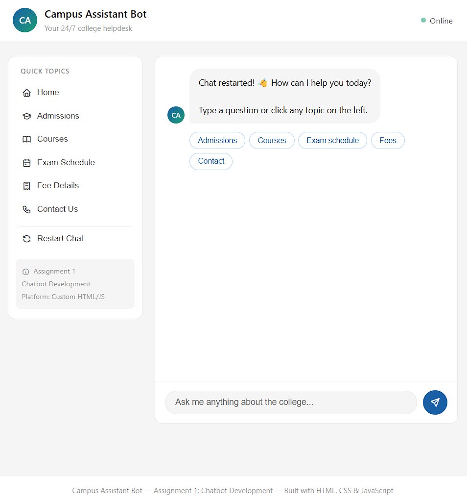
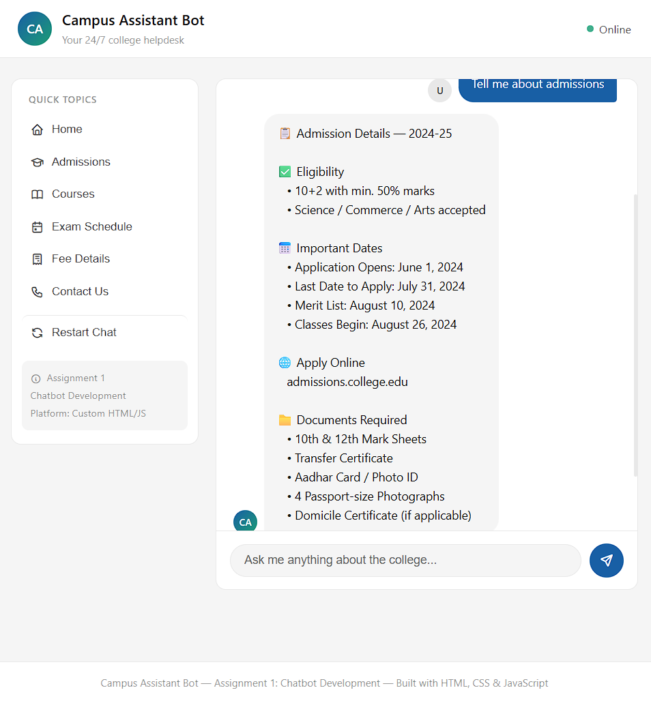
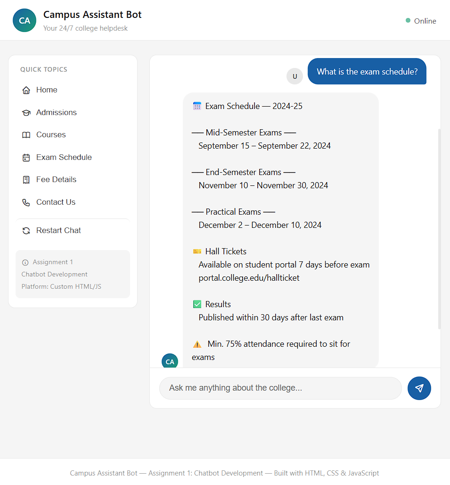
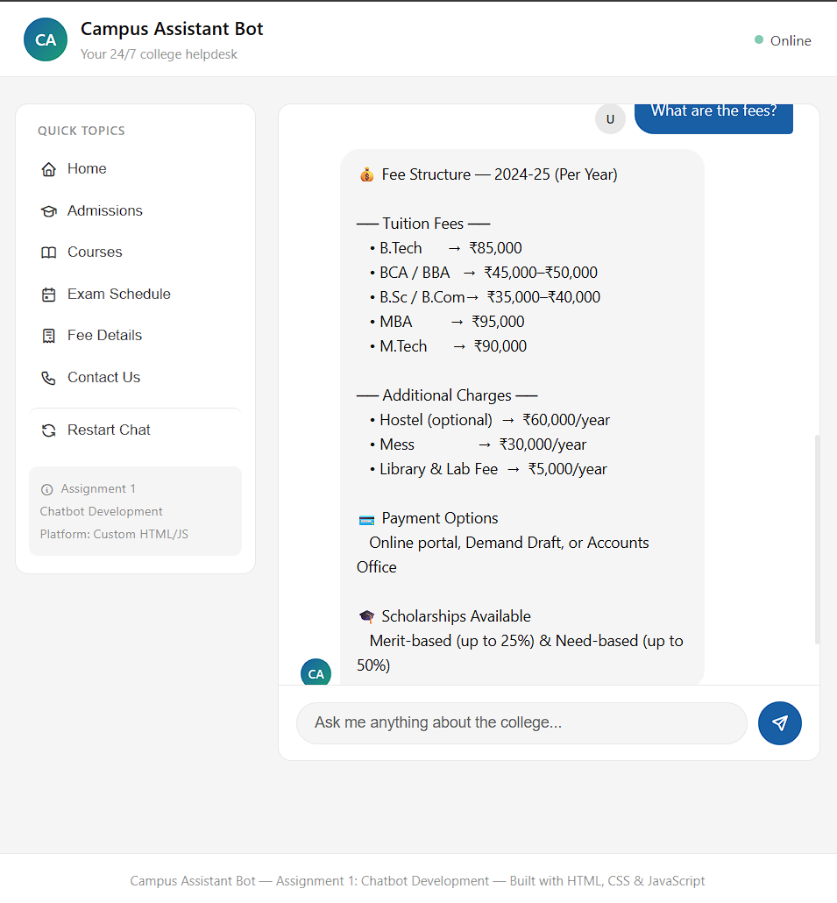
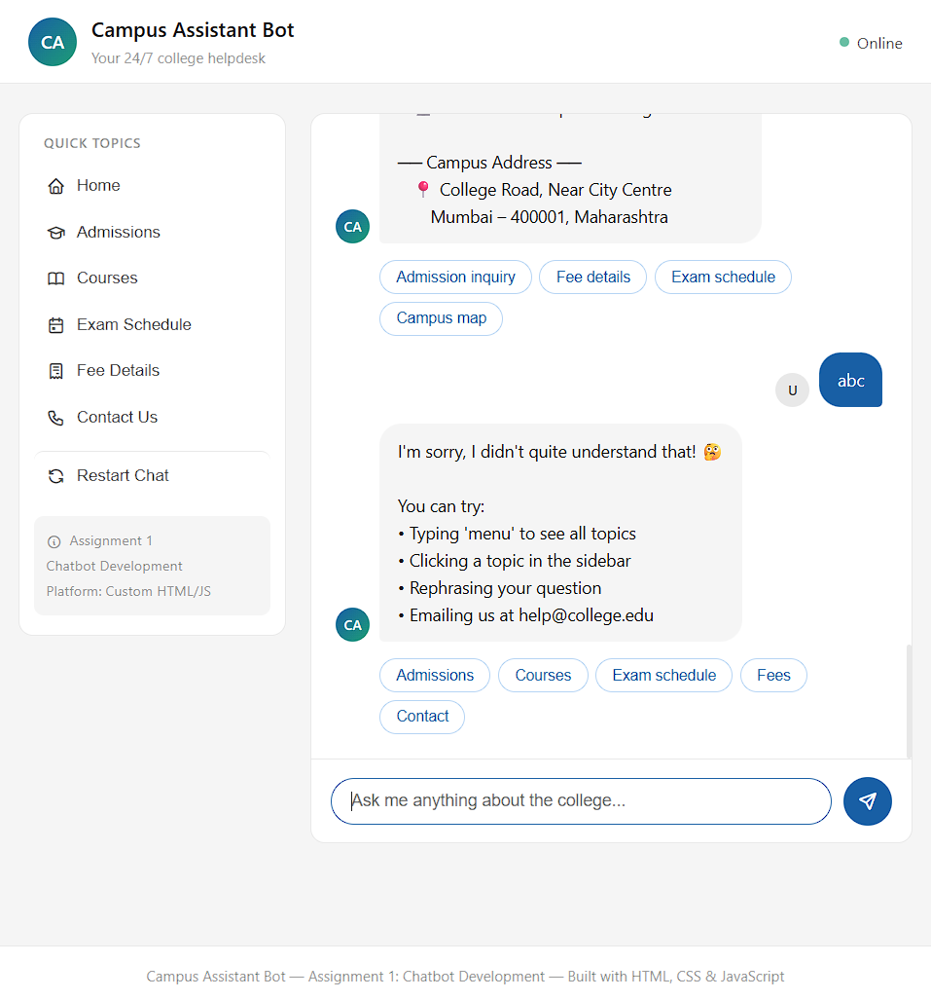
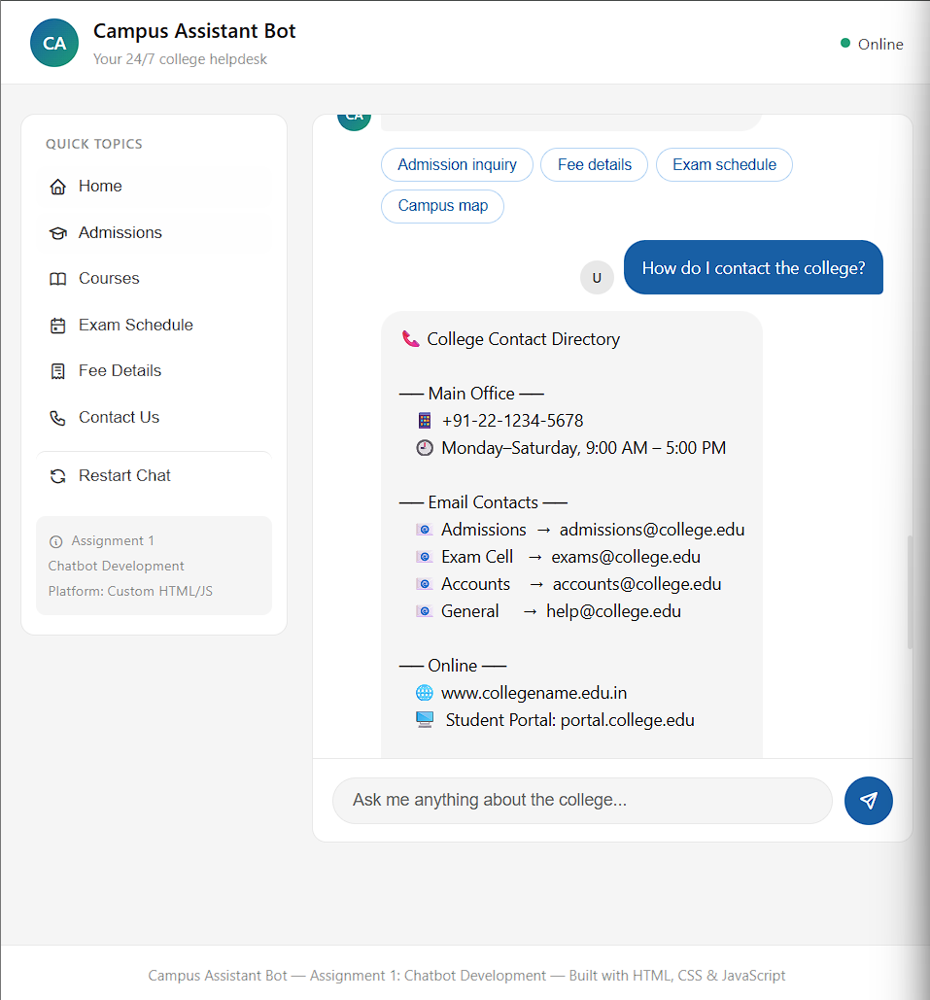

# 🎓 Campus Assistant Bot
 
Chatbot Development  
> A fully functional AI-style chatbot for college students, built with pure HTML, CSS, and JavaScript. No frameworks, no backend required.

---

## 🔴 Live Demo

👉 **[Open Campus Assistant Bot](https://deveshborse.github.io/-campus-assistant-bot/)**  

---

## 📸 Screenshots

| Welcome Screen | Admissions Query | Exam Schedule | Fees Details | Fallback Response |
Conversation |
|  |  |  |  |  |   |

---

## 🤖 What the Bot Can Answer

| Topic | Sample Questions |
|-------|-----------------|
| 🏫 **Admissions** | "How do I apply?", "What are the eligibility criteria?", "When is the last date?" |
| 📚 **Courses** | "What courses are available?", "Tell me about B.Tech", "Which programs do you offer?" |
| 📅 **Exam Schedule** | "When are the exams?", "Hall ticket details", "When are results published?" |
| 💰 **Fee Details** | "What is the tuition fee?", "Hostel charges?", "Scholarship information" |
| 📞 **Contact Info** | "How do I contact the college?", "Email address?", "Office timings?" |
| 🏆 **Scholarships** | "Tell me about scholarships", "Merit scholarship details" |
| ⚠️  **Fallback** | Any unrecognized input → friendly error + redirect options |

---

## 🚀 Features

- ✅ **5+ meaningful interactions** with relevant responses
- ✅ **Quick-reply buttons** after every bot response
- ✅ **Sidebar navigation** for one-click topic access
- ✅ **Typing animation** to simulate real bot behavior
- ✅ **Fallback/error handling** for unrecognized inputs
- ✅ **Responsive design** — works on mobile & desktop
- ✅ **No backend or API key required** — runs entirely in the browser

---

## 📁 Project Structure

```
campus-assistant-bot/
│
├── index.html       ← Main HTML file (chatbot UI)
├── style.css        ← All styling (responsive, dark-mode ready)
├── bot.js           ← Chatbot logic, knowledge base, intent matching
├── README.md        ← This file
└── screenshots/     ← Add your screenshots here for the report
    ├── welcome.png
    ├── admissions.png
    ├── exams.png
    └── fallback.png
```

---

## ⚙️ How It Works

```
User types a message
        ↓
bot.js converts input to lowercase
        ↓
Checks against keyword arrays in Knowledge Base (KB)
        ↓
┌─ Match found? ─────────────────── YES → Returns topic response + quick replies
│
└─ No match? ──────────────────────── NO → Returns fallback message
```

The Knowledge Base (`KB` object in `bot.js`) contains:
- **keys[]** — keywords to detect the topic
- **response** — the formatted answer string
- **quick[]** — follow-up quick-reply button labels

---

## 🛠️ Run Locally

### Option 1 — Just open the file
```bash
# Clone the repo
git clone https://github.com/YOUR-USERNAME/campus-assistant-bot.git
cd campus-assistant-bot

# Open directly in browser — no server needed
open index.html        # macOS
start index.html       # Windows
xdg-open index.html    # Linux
```

### Option 2 — With a local server (recommended)
```bash
# Using Python
python -m http.server 8000

# Then visit: http://localhost:8000
```

## 📖 Adding New Topics

Edit `bot.js` — add a new entry to the `KB` object:

```javascript
yourTopic: {
  keys: ['keyword1', 'keyword2', 'keyword3'],  // words that trigger this topic
  response: `Your multi-line response here...`,
  quick: ['Follow-up 1', 'Follow-up 2']         // quick reply buttons
}
```

## 🔮 Future Improvements

- [ ] Connect to **OpenAI / Claude API** for truly intelligent responses
- [ ] Add **voice input** using the Web Speech API
- [ ] **Login system** for personalized student data (fees due, marks)
- [ ] **Multi-language** support (Hindi, Marathi)
- [ ] **WhatsApp / Telegram** bot integration
- [ ] Connect to a **college ERP database** for real-time data

---

## 🛠️ Tech Stack

| Technology | Purpose |
|------------|---------|
| HTML5 | Structure & semantics |
| CSS3 | Styling, animations, responsive layout |
| Vanilla JavaScript | Bot logic, DOM manipulation, intent matching |
| Tabler Icons | UI icons (CDN) |
| GitHub Pages | Free hosting & live link |

---

## 📄 License

This project is created for academic purposes.  
Feel free to fork, modify, and use for your own assignments.

---

*Made with ❤️ for Assignment 1 — Chatbot Development*
